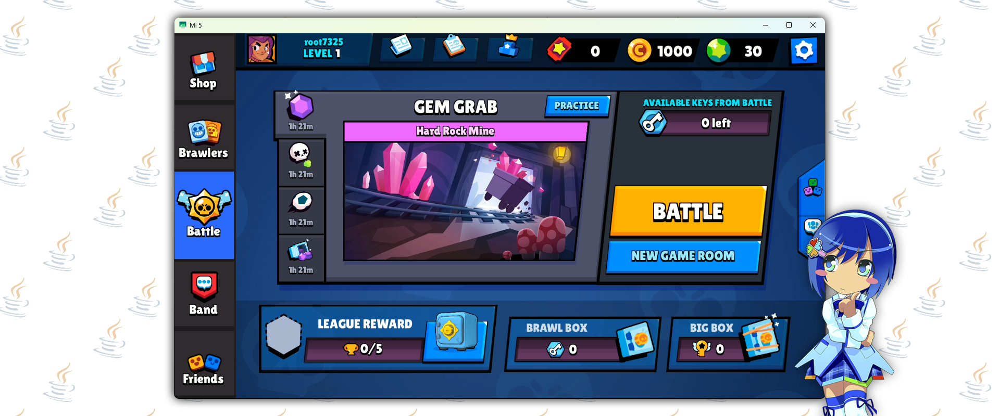

   
# JavaBS - a Brawl Stars (v12.187) server emulator ⚡
**JavaBS** is an **experimental server emulator** (even more experimental than [KyuBancho!](https://gitlab.com/root-7325/kyu-bancho)) written on **Java**.

## ⚠️ Before all
This project is in **alpha state**. There's **high chance** that stated features **won't be implemented**. Expect code updates with **a lot of overall structure changes**.

## 💭 Motivation
This project is a kind of **time machine into 2022 for me**, recreating good old days when I tried things in **Python**, lol. This is just **a fun experiment** to **relive** those memories. 

## 🎯 What's Working
- **Network Layer**: Netty-based TCP server
- **Processing**: Asynchronous processing via `ExecutorService` for non-blocking operations
- **Database**: MySQL integration with Hibernate ORM
- **Architecture**: DI with Guice, modular design
- **Game Logic**: Assets parsing, basic messages & commands implementations, session management
- **Configuration**: Flexible ruleset and config system

## 🚧 Potential Future Features
- Full-featured player profiles
- Leaderboards
- Gatcha system
- Implementation of most messages/commands
- Migrations with FlyWay
- PvP (don't expect)

## ⚙️ Requirements
- Java 17+
- Maven 3.6+
- MySQL Server

## 🚀 Quick Start
1. Setup MySQL Server
    - Use template located in `src/main/resources/hibernate.cfg.template.xml`
2. Fill out your config
    - Use template located in: `src/main/resources/config.yaml.template`
3. Fill out your ruleset
    - Use template located in: `src/main/resources/ruleset.yaml.template`
4. Build and run the server

> You can place your `.yaml` config files next to your `.jar` file or keep them inside in resources directory.

## 📃 License
This project is licensed under the [MIT License](LICENSE) - so do whatever you want with it, just don't blame me if something goes sideways.