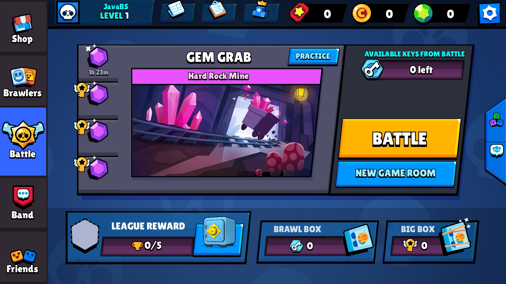

   
# JavaBS - a Brawl Stars (v12.187) server emulator ⚡
**JavaBS** is an **experimental server emulator** (even more experimental than [KyuBancho!](https://gitlab.com/root-7325/kyu-bancho)) written on **Java**.

## ⚠️ Before all
This project is in **alpha state**. There's **high chance** that stated features **won't be implemented**. The code also **may** contain bugs and **questionable** solutions!

## 💭 Motivation
This project is a kind of **time machine into 2022 for me**, recreating good old days when I tried things in **Python**, lol. This is just **a fun experiment** to **relive** those memories. 

## ✅ Implemented features
1. Netty implemented TCP server
2. Basic user session management
3. MySQL Database with Hibernate
4. TweetNaCl cryptography
5. Lobby at it's early stage (OHD only)
6. DI with Guice
7. Asynchronous processing
8. Flexible Ruleset system
9. Player profiles (own profile only)
10. Basic event manager

## 🚧 Potential Future Features
1. Full-featured player profiles
2. Leaderboards
3. Teams
4. Gatcha system
5. Stubs for some functions (matchmaking, battle log, etc.)
6. Assets parsing

## ⚙️ Requirements
- Java 17 or higher
- Maven 3.6 or higher
- MySQL Server
- Patched BS client (still can be found)

## 🚀 Quick Start
1. Setup MySQL Server
    - Fill in your credentials using template located in: `src/main/resources/hibernate.cfg.template.xml`
2. Check config
    - Use template located in: `src/main/resources/config.yaml.template`
3. Fill out your ruleset
    - Use template located in: `src/main/resources/ruleset.yaml.template`
4. Build and run the server

> You can place your `.yaml` config files next to your `.jar` file or keep them inside in resources directory.

## 📃 License
This project is licensed under the [MIT License](LICENSE) - so do whatever you want with it, just don't blame me if something goes sideways.